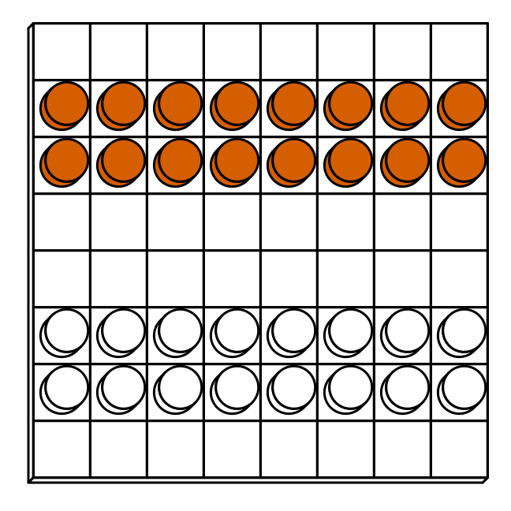

tradgames: Board game graphics for traditional game systems
============================================================

.. image:: https://github.com/piecepackr/tradgames/actions/workflows/R-CMD-check.yaml/badge.svg
    :target: https://github.com/piecepackr/tradgames/actions/workflows/R-CMD-check.yaml
    :alt: R-CMD-check

.. image:: https://codecov.io/github/piecepackr/tradgames/branch/master/graph/badge.svg)
    :target: https://app.codecov.io/github/piecepackr/tradgames?branch=master
    :alt: Coverage Status

.. image:: http://www.repostatus.org/badges/latest/wip.svg
   :alt: Project Status: WIP – Initial development is in progress, but there has not yet been a stable, usable release suitable for the public.
   :target: http://www.repostatus.org/#wip

.. _piecepack: http://www.ludism.org/ppwiki/HomePage
.. _piecepackr: https://github.com/piecepackr/piecepackr
.. _R: https://www.r-project.org/

``tradgames`` is an R_ package with functions that help generate board game graphics for games played with traditional board game components.  Right now it has a few functions that return the setups for some games that can be drawn with piecepackr_'s ``pmap_piece`` function.

.. contents::

Installation
------------

To install the ``tradgames`` R package use the following commands in R_:

.. code:: r

   install.packages("remotes")
   remotes::install_github("piecepackr/piecepackr") # recommended
   remotes::install_github("piecepackr/ppgames") # recommended
   remotes::install_github("piecepackr/tradgames")

License
-------

Unless otherwise specified everything in this repo is licensed under the `CC BY-SA 4.0 license <https://creativecommons.org/licenses/by-sa/4.0/>`_.

Starting Boards
---------------

This package comes with a few functions that return tibbles representing the starting board arrangement for games played with traditional board game components.  These can be visualized with ``piecepackr::pmap_piece`` or ``ppgames::cat_piece``.

.. sourcecode:: r
    

    library("tradgames")
    library("piecepackr")
    pmap_piece(df_breakthrough(), envir=game_systems(), default.units="in", trans=op_transform, op_scale=0.5)

.. figure:: man/figures/README-breakthrough-1.png
    :alt: Starting position for Dan Troyka's abstract game "Breakthrough"

    Starting position for Dan Troyka's abstract game "Breakthrough"

.. sourcecode:: r
    

    pmap_piece(df_turkish_draughts(), envir=game_systems(), default.units="in", trans=op_transform, op_scale=0.5)

    Starting position for Turkish Draughts

.. sourcecode:: r
    

    ppgames::cat_piece(df_four_field_kono())

::

    ##  ┌─┰─┰─┰─┐
    ##  │⛂┃⛂┃⛂┃⛂│
    ##  ┝━╋━╋━╋━┥
    ##  │⛂┃⛂┃⛂┃⛂│
    ##  ┝━╋━╋━╋━┥
    ##  │⛀┃⛀┃⛀┃⛀│
    ##  ┝━╋━╋━╋━┥
    ##  │⛀┃⛀┃⛀┃⛀│
    ##  └─┸─┸─┸─┘
    ## 

